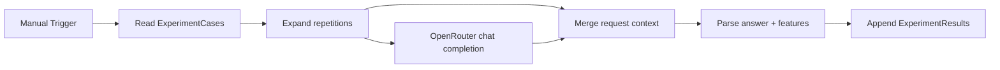
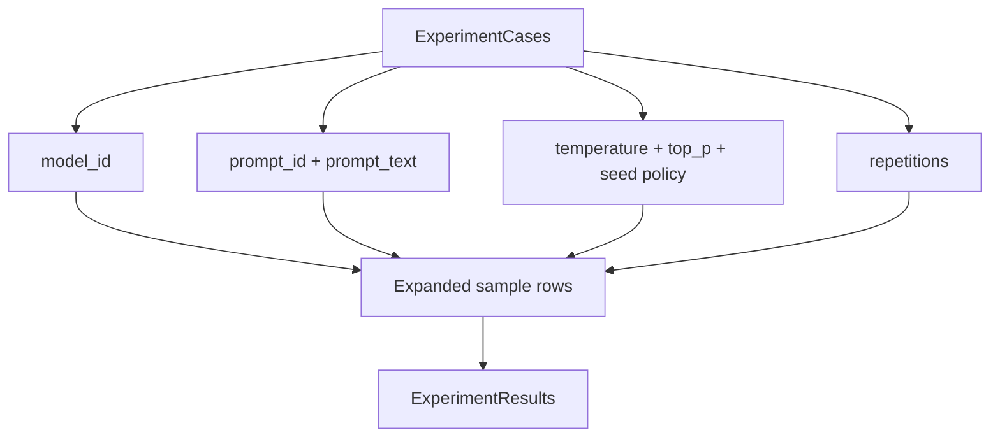
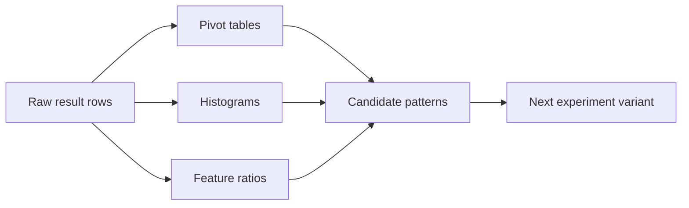

# Mermaid Workflows

## Experiment Runner

```mermaid
flowchart LR
    A["Manual Trigger"] --> B["Read ExperimentCases"]
    B --> C["Expand repetitions"]
    C --> D["OpenRouter chat completion"]
    C --> E["Merge request context"]
    D --> E
    E --> F["Parse answer + features"]
    F --> G["Append ExperimentResults"]
```

## Data Model

```mermaid
flowchart TD
    A["ExperimentCases"] --> B["model_id"]
    A --> C["prompt_id + prompt_text"]
    A --> D["temperature + top_p + seed policy"]
    A --> E["repetitions"]
    B --> F["Expanded sample rows"]
    C --> F
    D --> F
    E --> F
    F --> G["ExperimentResults"]
```

## Analysis Pass

```mermaid
flowchart LR
    A["Raw result rows"] --> B["Pivot tables"]
    A --> C["Histograms"]
    A --> D["Feature ratios"]
    B --> E["Candidate patterns"]
    C --> E
    D --> E
    E --> F["Next experiment variant"]
```
